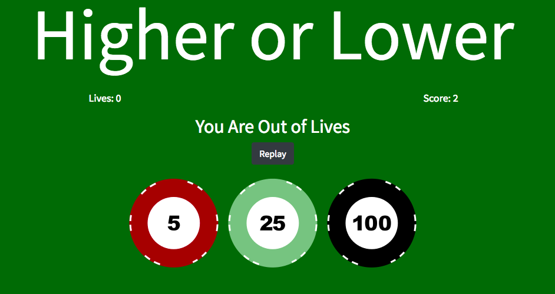

#Higher or Lower
###By Arun Kalwan

A Higher or Lower game made with HTML, CSS and JavaScript. Higher or Lower is a fun card game that requires players to correctly guess what the next card is going to be. Higher or Lower is highly addictive game which lets player keep track of their scores. This game can be played casually, competitively or even as a drinking game.

[Link To The Game](https://arunkal1.github.io/Higher-Or-Lower/)

To clone the repository, [go to this link ](https://github.com/arunkal1/Higher-Or-Lower) and you will see the following page: 

Click on the **Clone or Download** button to clone this repository . Then download as a .ZIP file, after unzipping the file go to the Higher Or Lower folder and open the index.html file in your browser.

##How to Play:

The game is simply to play. Upon loading the page you will be presented with the below:

To Start the game, simply press the Start button, this will generate you your first card on the right deck.

Once you have generated you first card on the right hand side, then the player must guess whether the new card is going to be **Higher** or **Lower**.

Once the player has guessed **Higher** or **Lower** the new card will appear and your old card will move onto the deck on the left. The start button will also no longer be visible. 

The game will keep track of your score and your lives remaining. Each player starts their game with **3 Lives** and **0 Score**. The **Score** will increment for each correct guess and the **Lives** will decrement for each incorrect guess.

Once the player reaches **0 Lives** it is **GAME OVER**. The player will then be presented with the below screens:

If the player chooses to play again by pressing (1) then the page will be reloaded as a fresh game, however, if they press (2) and choose not to replay then they will be diverted to the following page:

##Rules:

* The player is allocated 3 lives and loses 1 life for each incorrect guess.
* The player starts from 0 points and gains 1 point for each correct guess.
* The player must decide whether the next card is going to be higher or lower than the previous card.

##Development Process:
Development of this game started from creating two arrays, one for the first card generated and one for the second card created. A random number was then created using **Math.random()** which was assigned to each position in the array. Therefore, a random number is associated to each card.

A switch statement was used to compare the cards and determine which value each card had. After determining the value of the card I used logic to compare which card was higher in terms of numerical value, checking to see if one number was higher or lower than another number. 

Two buttons were created to see if the player pressed for a higher number or a lower number, if they selected "higher" it would check if the card generated was higher than the next random card, and if it was to award one point, if it was lower it would deduct a life. On the other hand if they selected "lower" it would check if the card generated was lower than the next random card, and if it was to award  a point, if it was higher it would deduct a life.

The cards would then move across decks by assigning the value of the random card 2 to the position of random card 1.

After the general game play was completed, the game was styled using CSS and KeyFrame animations.

##Future Development:
Future development would consist of connecting the game to a database to store players highscores.
